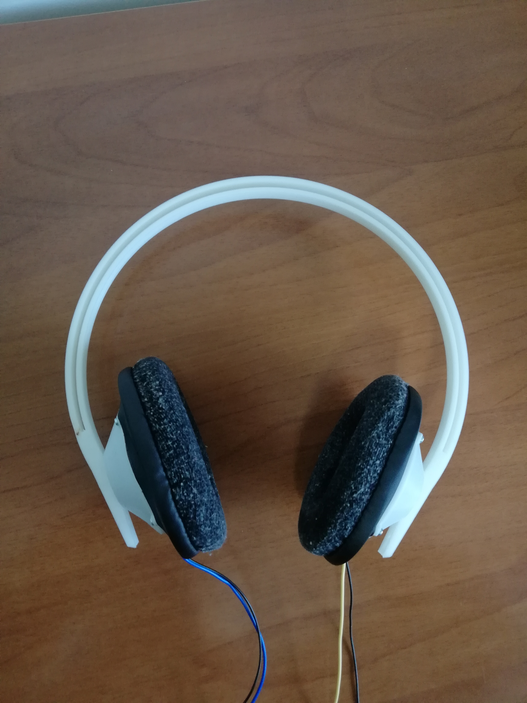

# ATH-M30X-Rebuild

So I took apart my old headphones in an attempt to repair them when one side wasn't working.
After a failed attempt at repairing them, I threw all the components away except the drivers and ear cups.
Turns out, both drivers were working so I just designed and 3D-printed the rest of the headphones.

## Iteration 1:
	* Janky wiring: For next iteration, I will use higher quality cable better suited for audio.
	* Non-adjustable headband: I did this in a day and I just wanted to see something working. I will work on a better design in the future.
	* Sound leaks: Might make the cups thicker 
	* Ear cups don't sit perfectly
	* But it actually works?